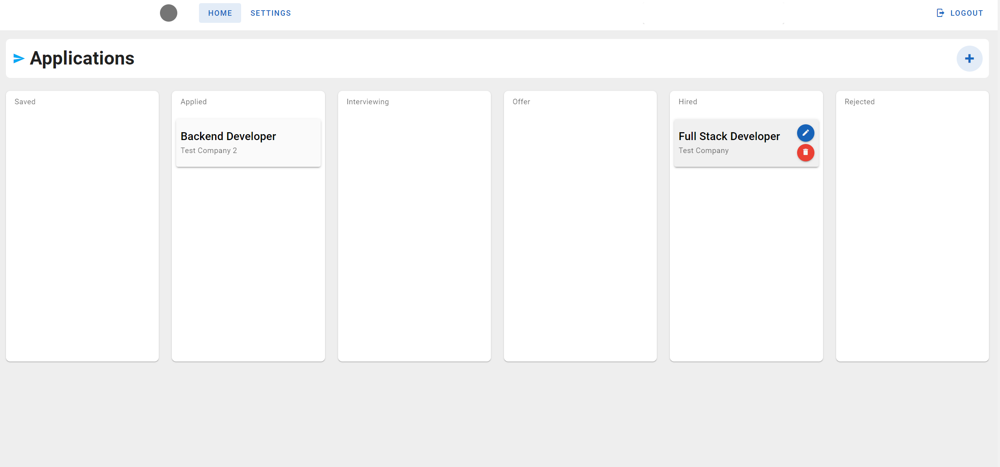
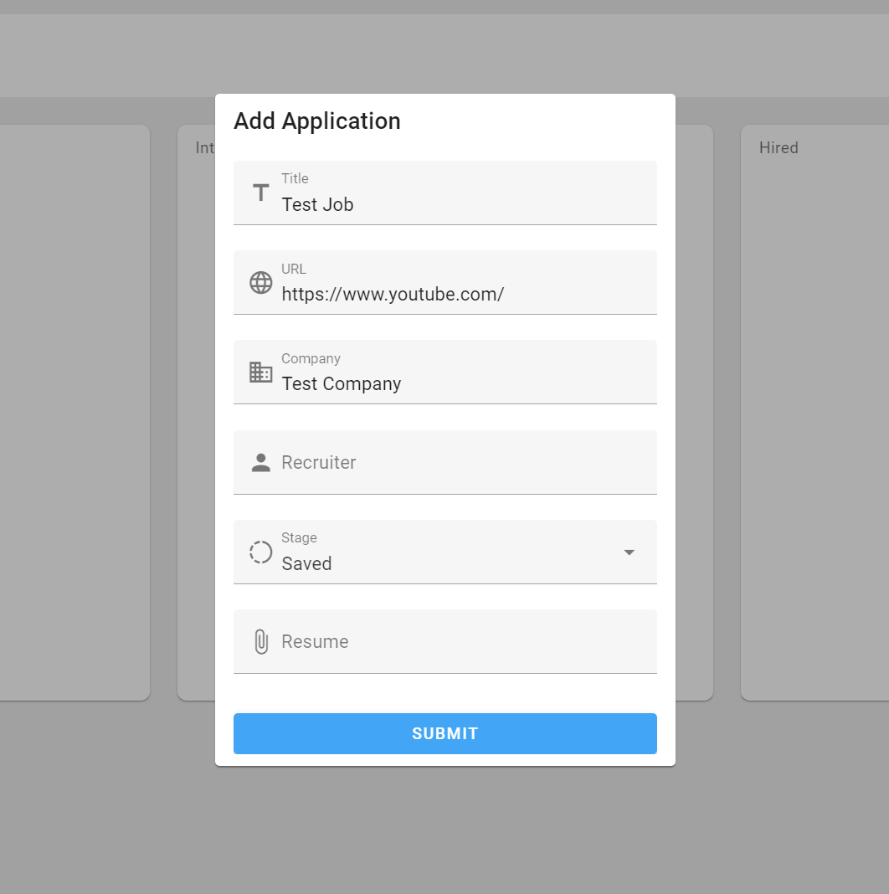
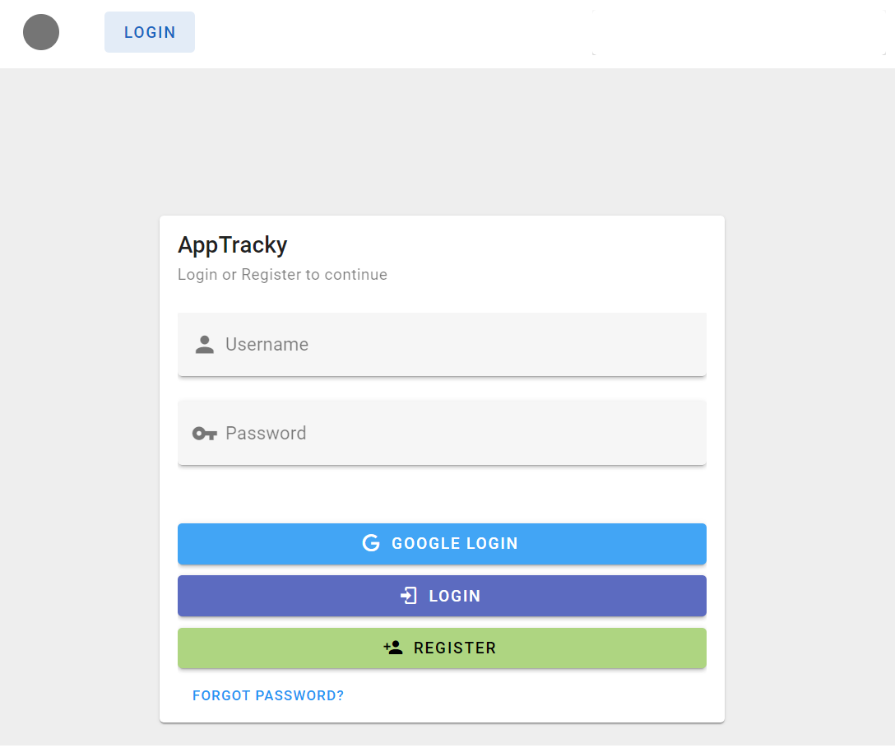
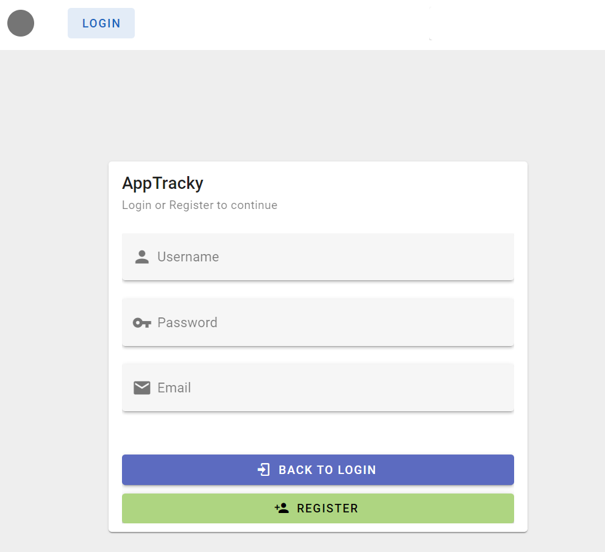
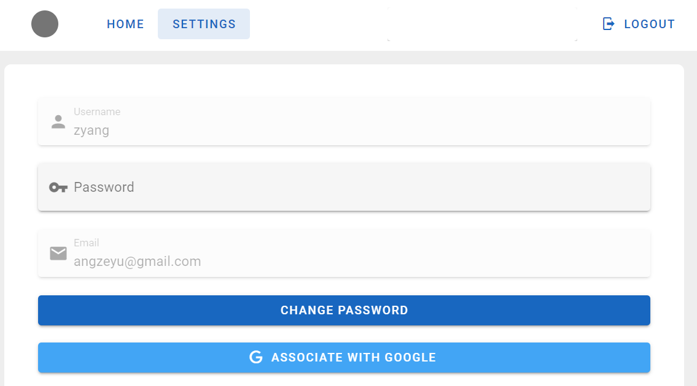
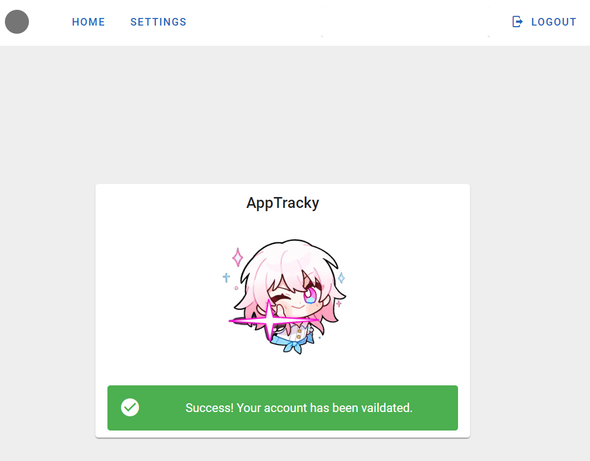

# AppTracky

WIP Job application tracking demo app made mostly to familiarise with OAuth authentication flows on Spring Boot.

Done:
- [x] Authentication flows (APIs / frontend)
   - [x] Basic auth (login, registrartion, forgot password, change password, email validation)
   - [x] Oauth/OIDC (Google login/registration)
   - [x] Federated identity (associating Google account to validated basic auth accounts)
- [x] Frontend
   - [x] Layout scaffolding
   - [x] Authentication related things
 - [x] Drag-and-drop kanban board for applications and APIs
 
TBD:
- [ ] S3 uploads for PDF resumes
- [ ] AWS SSM Parameter Store / Secrets Manager integration

The backend is built with Spring Boot, and heavy use of Spring Security for Authentication.

Both basic auth and oauth flows ultimately result in the issuing of a JWT used for endpoint authentication and authorization. 

Frontend is a simple Vue app built on Vuetify + Vite.

