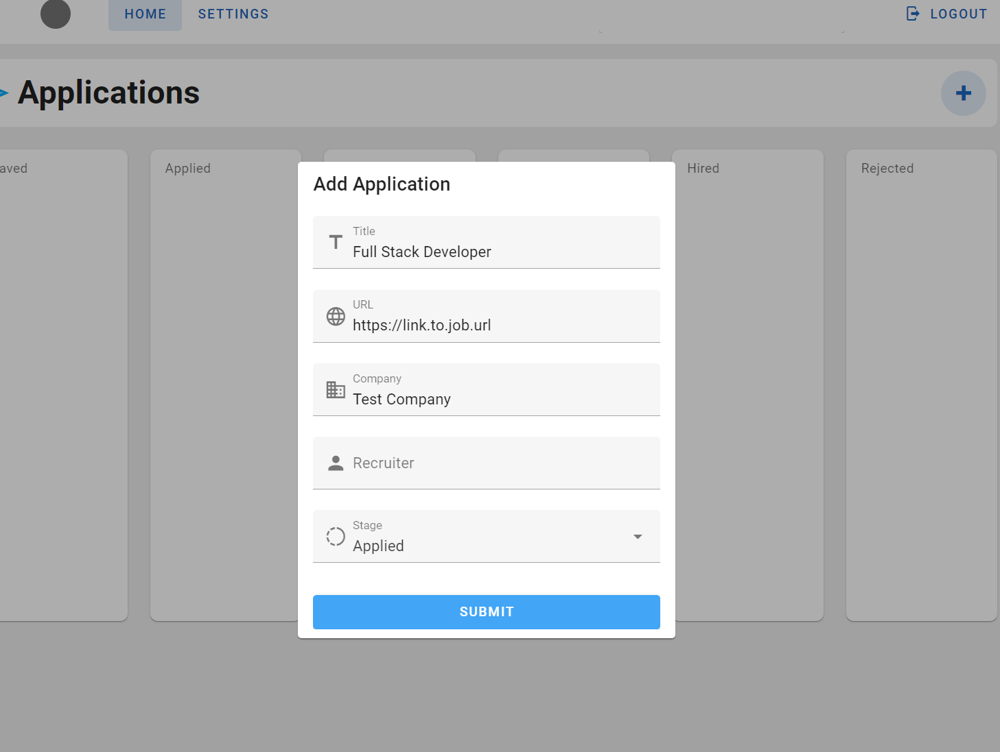

# AppTracky

## Introduction

Job application tracking demo app made mostly to:
- Familiarise with OAuth authentication flows on Spring Boot.
- AWS practice (ECS, ECR, IAM, S3, S3 presigning, RDS, SSM Parameter store)
- Try my hands at browser drag-drop APIs

#### Done

- [x] Authentication flows (APIs / frontend)
   - [x] Basic auth (login, registrartion, forgot password, change password, email validation)
   - [x] Oauth/OIDC (Google login/registration)
   - [x] Federated identity (associating Google account to validated basic auth accounts)
- [x] Frontend
   - [x] Layout scaffolding
   - [x] Authentication related things
- [x] Drag-and-drop kanban board for applications and APIs
- [x] Presigned urls S3 uploads for PDF resumes
- [x] AWS SSM Parameter Store integration for OAuth/RDS secrets
- [x] Containerize the backend for easier development, and ECS deployment
- [x] Setup ECS task defs, cluster, S3 bucket policies, IAM for GH actions
- [x] Build and deploy image to ECS, and frontend to S3 automatically with GH actions

#### TBD

- [ ] ($$) (Maybe) HTTPs and domains for S3 frontend and ALB to front ECS (instead of dynamic public IP)
- [ ] (Maybe) CloudFormation-ify everything AWS related

## Implementation Overview

### Backend & Authentication/Authorization

- The core backend REST API is built with Spring Boot & Hibernate.
- Spring Security abstractions are heavily for Authentication. Both basic + oauth flows ultimately result in the issuing of a JWT used for endpoint authentication and authorization. Federated identity is done on the basis of user emails, verified via OIDC.
- Registration/forgot password emails are sent using AWS SES, and user resume uploads using S3.
- RDS/OAuth secrets are retrieved from AWS SSM parameter store.

The frontend is a simple Vue app built on Vuetify + Vite.

### Infrastructure

All resources have been taken down to save $$.

- A [S3 bucket](http://zyang-apptracky.s3-website-ap-northeast-1.amazonaws.com/) hosts the frontend.
- Another S3 bucket hosts user uploaded resumes. Authentication (GET/PUT) is done via presigned URLs generated on the backend.
- The backend is contanerized, supporting docker compose for easy development with a postgres container. 
  Production deployment utilises AWS ECS (Fargate launch type) and RDS for the database.
   - Fargate tasks also have the option of generating dynamic public IPs, which is what's used to connect the frontend to backend.
- For simplicity, everything uses the default VPC and subnet.
- There is no HTTPs and/or custom domains setup to save on $$ since this a demo project.
- There is also a Github Actions workflow to:
   1. `./gradlew build` and containerize the backend image, and upload it into AWS ECR.
   2. Build and frontend app and upload it into AWS S3

## Screenshots

